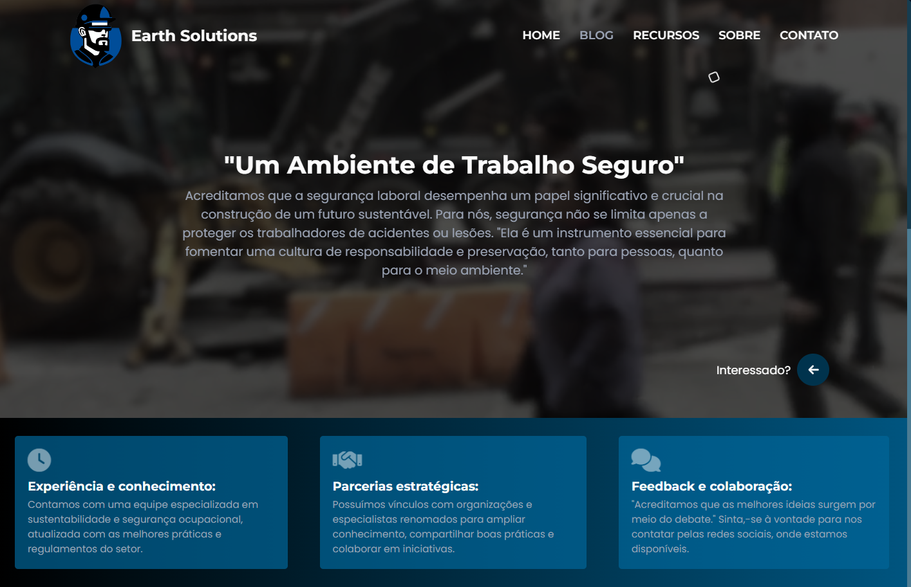
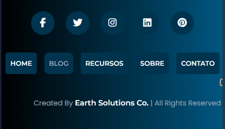
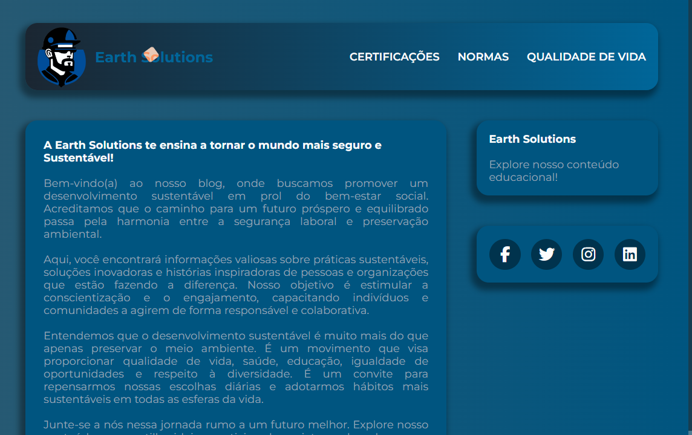

<!-- Projeto Finalizado -->
# 🌍 Earth Solutions
<p align="center">
  <!-- Contador de linguagens do GitHub -->
  
  <!-- Tamanho do repositório no GitHub -->
  
  <!-- Licença do GitHub -->
  
</p>

<div align="center">
  
</div>

## 📋 Sobre o Projeto
Este projeto educacional é um trabalho da faculdade que destaca práticas para um ambiente de trabalho seguro e sustentável, com páginas sobre segurança ocupacional e proteção ambiental.

## 🌟 Características Principais
- **Conteúdo Informativo**: Informações sobre segurança no trabalho e práticas sustentáveis.
- **Interatividade**: Exploração de recursos dinâmicos utilizando CSS e JavaScript.
- **Design Responsivo**: O layout se adapta a diferentes tamanhos de tela.

## 🧭 Guia de Implementação
1. **Clone o repositório**:
   ```bash
   git clone https://github.com/devAndreotti/APS-01.git
   ```
2. **Abra o arquivo `index.html` no navegador**.

## 🚀 Estrutura do Projeto
```
├── html/                                   # Diretório principal do HTML
│   ├── index.html                          # Página principal do projeto
│   ├── blog/                               # Diretório do blog
│   │   ├── index_blog.html                 # Página inicial do blog
│   │   └── sub_pages/                      # Subpáginas do blog
│   │       ├── index_certificacoes.html    # Página de certificações
│   │       ├── index_dds.html              # Página sobre DDS
│   │       └── index_normas.html           # Página sobre normas de segurança
├── assets/                                 # Diretório de recursos adicionais
│   ├── css/                                # Arquivos de estilo CSS
│   │   ├── style_blog.css                  # Estilo para a página do blog
│   │   └── style_index.css                 # Estilo para a página principal
│   ├── img/                                # Imagens do projeto
│   │   ├── blog/                           # Imagens específicas do blog
│   │   ├── icons/                          # Ícones
│   │   └── safety/                         # Imagens relacionadas à segurança
│   ├── js/                                 # Scripts JavaScript
│   │   └── main.js                         # Script principal do projeto
│   └── vd/                                 # Vídeos e outros recursos multimídia
└── README.md                               # Documentação do projeto
```

# 🖥️ CSS Institucional
<div align="center">
  
</div>
O CSS do arquivo `index.html` foi projetado para um visual moderno e fácil modificação. Confira os destaques:

## 1. Importação de Fontes 🅰️
Fontes do Google Fonts, como **"Montserrat"** e **"Poppins"**, garantem tipografia elegante e legível.

## 2. Definição de Variáveis de Cor 🎨
Variáveis CSS no `:root` asseguram um esquema de cores consistente e fácil manutenção.

## 4. Barra de Rolagem 🌀
Barra de rolagem personalizada alinha-se ao esquema de cores do site para uma experiência visual harmoniosa.

## 5. Barra de Navegação 📍
Barra fixa no topo muda de cor ao rolar e vira menu hambúrguer em telas menores, melhorando a usabilidade.

## 6. Logo 🌟
Logotipo na barra de navegação muda de cor e gira como uma moeda ao passar o mouse, destacando a identidade do site.

## 7. Seções do Conteúdo 📚
- **Características:** Layout flexível com efeitos de `hover` em caixas de conteúdo.
- **Razão:** Texto centralizado com efeitos de `hover` destacando o texto.
- **Recursos:** Organização automática e efeitos interativos em texto e imagens.
- **Sobre:** Efeitos de deslocamento no texto para melhor legibilidade.
- **Rodapé:** Estilização com botões arredondados e feedback visual interativo.

# 🖥️ CSS do Blog
<div align="center">
  
</div>
CSS do arquivo `index_blog.html` e das `sub_pages` do blog. Veja os destaques:

## 1. Importação de Fontes 🅰️
Fontes elegantes do Google Fonts, como **"Montserrat"** e **"Poppins"**, garantem uma tipografia moderna.

## 2. Definição de Variáveis de Cor 🎨
Variáveis CSS no `:root` asseguram um esquema de cores consistente e fácil manutenção.

## 3. Barra de Rolagem 🌀
Design personalizado da barra de rolagem melhora a estética e a navegação no blog.

## 4. Barra de Navegação 📍
- **Estilo e Layout:** Fixa no topo com gradientes e sombras para um visual moderno.
- **Interação:** Logotipo e links mudam de cor e transformam ao passar o mouse.

## 5. Conteúdo 📚
- **Bloco de Conteúdo:** Estilização com fundo e bordas arredondadas.
- **Imagens:** Centralização e ajuste com bordas arredondadas.
- **Glossário e Contato:** Estilos para listas e botões interativos.

# 🖥️ JavaScript

## 🎨 Mudança de Cor da Barra de Navegação
A barra de navegação muda de cor ao rolar, oferecendo uma transição visual suave.

## 🔻 Ocultação da Barra de Navegação no Final
A barra desaparece ao chegar ao final da página e reaparece conforme necessário para uma leitura limpa.

## 🧭 Navegação Suave
Transições suaves entre seções evitam movimentos bruscos e melhoram a fluidez da navegação.

## 🖱️ Cursor Customizado
Cursor personalizado muda de forma e tamanho ao passar sobre elementos interativos.

## 📚 Glossário Responsivo
O glossário se move com a rolagem da página, mantendo as informações sempre visíveis.

# 💪 Como Contribuir
Contribuições são bem-vindas! Siga estas etapas para colaborar:
1. Faça um fork do projeto.
2. Crie uma nova branch para sua feature: `git checkout -b feature/nome-feature`.
3. Commit suas mudanças: `git commit -m 'Adiciona nova feature'`.
4. Envie para a branch: `git push origin feature/nome-feature`.
5. Abra um Pull Request.

# 📝 Nota
Este projeto foi desenvolvido como parte de um trabalho em grupo para a faculdade, realizado uma vez a cada semestre. O trabalho envolve a criação de soluções práticas e aplicáveis que demonstrem o conhecimento adquirido ao longo do curso.

